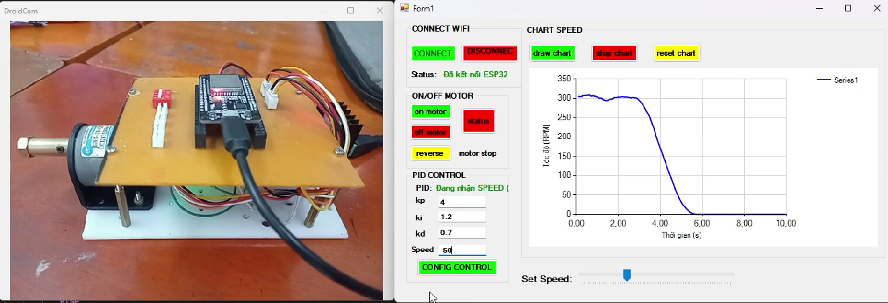

# 🚀 ESP32 Dual-Core Closed-Loop DC Motor Speed Control

<p align="center">
  
  
  
  
  
</p>

## 📌 Overview

A **real-time closed-loop DC motor speed control system** using **ESP32, Embedded C, FreeRTOS and PID control**.

The system reads motor speed from a quadrature Hall Encoder, filters the feedback using an IIR filter, calculates PID output with Anti-Windup, and controls the motor through PWM.

A **C# WinForms application** communicates with the ESP32 over Wi-Fi for real-time monitoring and PID configuration.

## 📷 System Model

<p align="center">
  
</p>

## 🛠️ Hardware

* **MCU:** ESP32-WROOM-32 Dual-Core @ 240 MHz
* **Motor:** DC Motor + Quadrature Hall Encoder (330 PPR)
* **Motor Driver:** L298N H-Bridge
* **PWM:** ESP32 LEDC, 5 kHz
* **Encoder:** ESP32 PCNT
* **Communication:** Wi-Fi SoftAP
* **Power:** 12 VDC

## 💻 Software Architecture

```text
              ESP32
                │
       ┌────────┴────────┐
       │                 │
    Core 0             Core 1
       │                 │
       ▼                 ▼
 PID Control         Wi-Fi / HTTP
   Task                 Task
       │                 │
       ▼                 ▼
    PCNT               REST API
       │                 │
       ▼                 ▼
 IIR Filter           cJSON
       │                 │
       ▼                 ▼
 PID + Anti-Windup    NVS Flash
       │
       ▼
    PWM / LEDC
       │
       ▼
    DC Motor
```

### Real-Time Control Loop

```text
Encoder → PCNT → RPM → IIR Filter → PID → PWM → Motor
```

* Control period: **10 ms (100 Hz)**
* `vTaskDelayUntil()` for periodic scheduling
* FreeRTOS Mutex for shared data protection
* PID task separated from Wi-Fi processing

## 🌐 REST API

| Endpoint      | Method | Description         |
| ------------- | ------ | ------------------- |
| `/`           | GET    | Check ESP32 status  |
| `/rpm`        | GET    | Read filtered RPM   |
| `/target`     | GET    | Read target RPM     |
| `/pwm`        | GET    | Read PWM output     |
| `/kp`         | GET    | Read Kp             |
| `/ki`         | GET    | Read Ki             |
| `/kd`         | GET    | Read Kd             |
| `/api/config` | POST   | Update PID + target |

Example configuration:

```json
{
  "target_rpm": 120,
  "kp": 1.2,
  "ki": 0.5,
  "kd": 0.05
}
```

Configuration is stored in **NVS Flash** and restored after restart.

## 🖥️ C# Monitoring Application

The WinForms application provides:

* Real-time RPM monitoring
* Target RPM configuration
* PID parameter tuning
* PWM monitoring
* ESP32 connection status

## 📊 Results

* **100 Hz** closed-loop control
* **10 ms** control period
* Hardware encoder counting using **PCNT**
* Remote PID configuration via **HTTP + JSON**
* Persistent configuration using **NVS**
* Thread-safe shared data using **FreeRTOS Mutex**

## 📂 Project Structure

```text
esp32_pid_control_motor/
│
├── components/
│   ├── motor_pid/
│   │   ├── include/
│   │   │   └── motor_pid.h
│   │   ├── motor_pid.c
│   │   └── CMakeLists.txt
│   │
│   └── web_server/
│       ├── include/
│       │   └── web_server.h
│       ├── web_server.c
│       ├── CMakeLists.txt
│       └── idf_component.yml
│
├── main/
│   ├── main.c
│   └── CMakeLists.txt
│
├── UI/
│   ├── UI.sln
│   └── UI/
│       ├── Form1.cs
│       ├── Form1.Designer.cs
│       ├── Form1.resx
│       ├── Program.cs
│       └── giaodien.csproj
│
├── image/
│   └── system_model.png
│
├── .gitignore
├── CMakeLists.txt
├── dependencies.lock
├── sdkconfig
└── README.md
```

## 🚀 Build & Run

```bash
git clone https://github.com/giabao/esp32-dc-motor-pid-control.git
cd esp32-dc-motor-pid-control

idf.py set-target esp32
idf.py build
idf.py -p COMx flash monitor
```

Connect to:

```text
SSID: ESP32_WIFI
Password: 12345678
IP: 192.168.4.1
```

---

### 🔑 Key Embedded Skills

**Embedded C · ESP-IDF · FreeRTOS · Dual-Core · PCNT · PWM · PID · Anti-Windup · IIR Filter · Mutex · Wi-Fi · HTTP REST API · JSON · NVS · C# WinForms**
